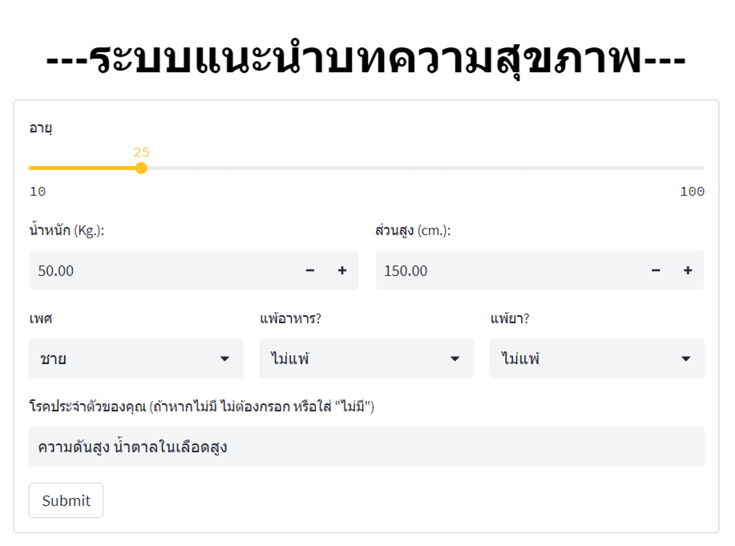

# Article Recommendation System for Elderly Adults

The project's objective is to develop a recommendation system that suggests articles based on the personal information provided by elderly users. The aim is to assist elderly adults in finding the most relevant articles based on their medical conditions and health data. The system collects health-related articles from public data available on various hospital websites. It uses three algorithms to recommend articles: Automatic Keyword Extraction, Bertopic, and Ontology Network. Web application allows general users or interested individuals to test the article recommendation system, implemented with Gradio and published on Hugging Face.

## Huggingface🤗
https://huggingface.co/spaces/Jiranuwat/Healthcare_Articles_Recommend

